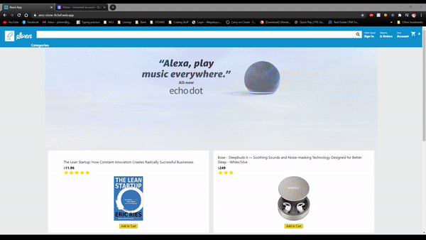

<h1 align="center">Sven 💻 </h1>

  A <code>ReactJS</code> e-Commerce web application designed as an alternative solution for Amazon or Best Buy

 

  

  

  🧭Explore: 
  <a href="https://www.youtube.com/watch?v=np1HToLy1QI">Demo</a> || <a href="https://amz-clone-8c5ef.web.app/">Deployed App</a>
  

## Features 
- Sign in/Sign up option with authenticated password
- View previous orders 
- Ability to add items to cart and purchase them
- Able to remove unwanted items from cart
  
 
## Tech Stack
This web app makes use of the following:
- Reactjs
- Firebase - Backend
- JavaScript - CSS framework based on Flexbox.